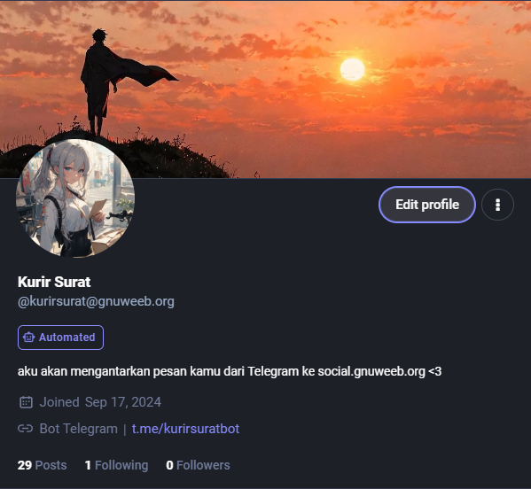
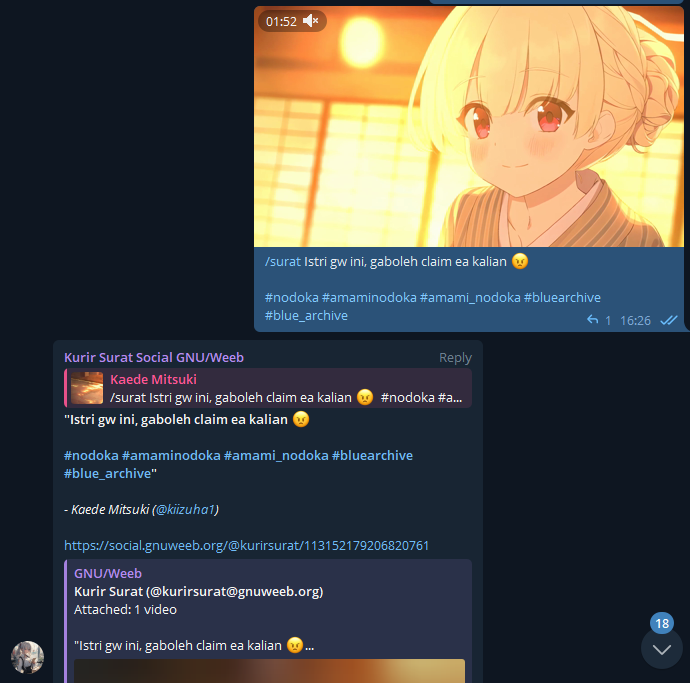
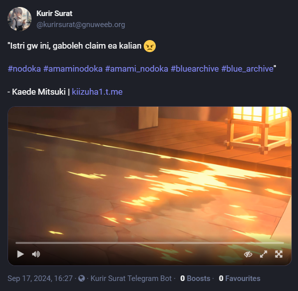

<h1 align="center">Kurir Surat Mastogram (Mastodon Telegram) Bot</h1>

<p align="center"></p>

---

### Requirements

- [Python 3.12.4](https://www.python.org/downloads/release/python-3124/) (Recommended)
- Mastodon account, you can register it [here](social.gnuweeb.org)
- Telegram bot account, register you Telegram account and go to [@BotFather](https://botfather.t.me)

### Setup

```sh
git clone https://github.com/rushkii/kurirsurat-mastodon.git rushkii/kurirsurat-mastodon
cd rushkii/kurirsurat-mastodon
pip install -r requirements.txt
```

### Configurations

editing your .env, create a file with name `.env` then copy paste from the `.env.example` your create `.env` file.

```properties
# TELEGRAM
# get it from https://my.telegram.org
API_ID=
API_HASH=""
# get it from https://botfather.t.me
BOT_TOKEN=""


# MASTODON
# get it from your account and create app (development)
MASTODON_ACCESS_TOKEN=""
# mastodon URL
MASTODON_HOST_URL=""
# your mastodon bot account URL
MASTODON_USER_URL=""
```

### Running

Run command

```sh
python main.py
```

### Demo

|                      From Telegram                      |                      To Mastodon                       |
| :-----------------------------------------------------: | :----------------------------------------------------: |
|  |  |
